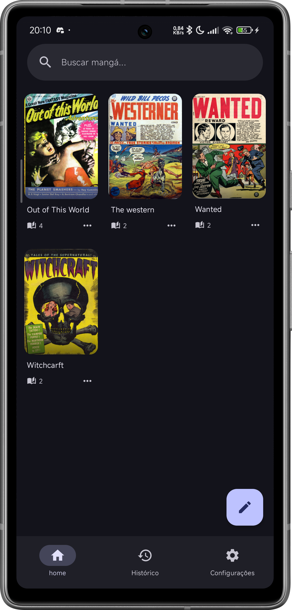
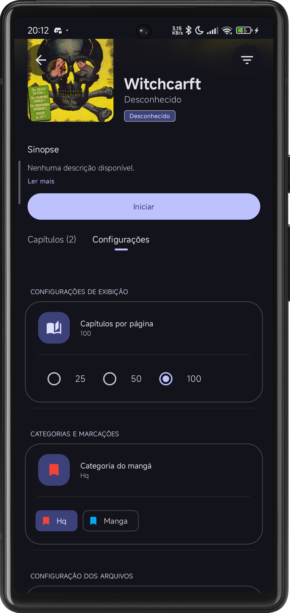
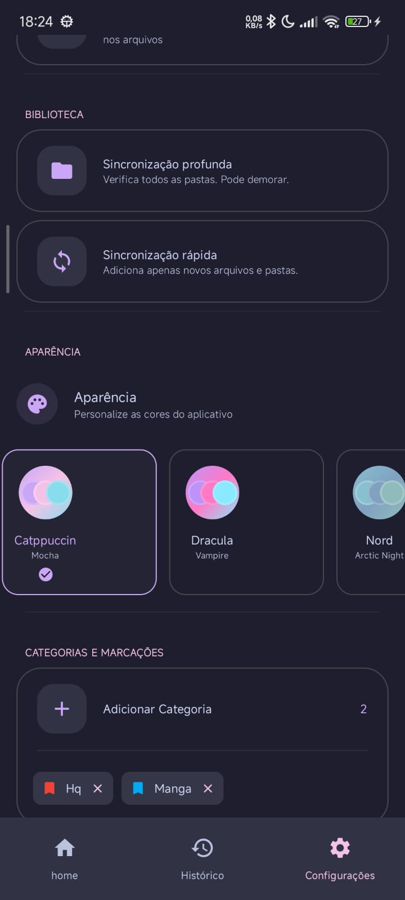
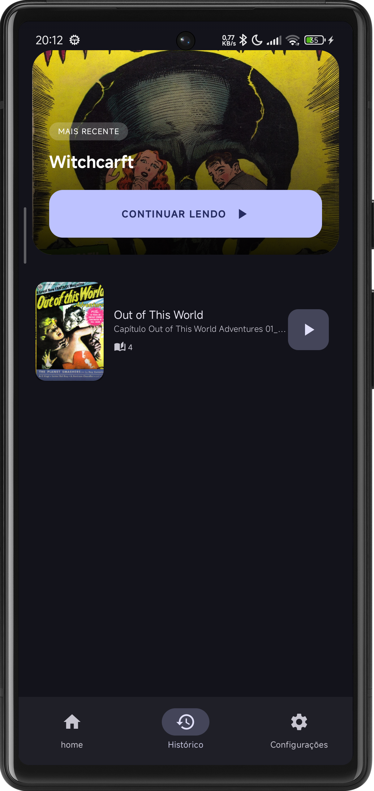
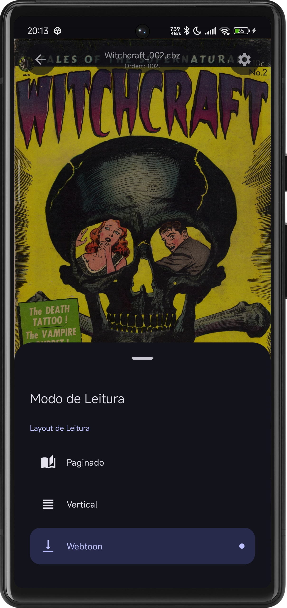
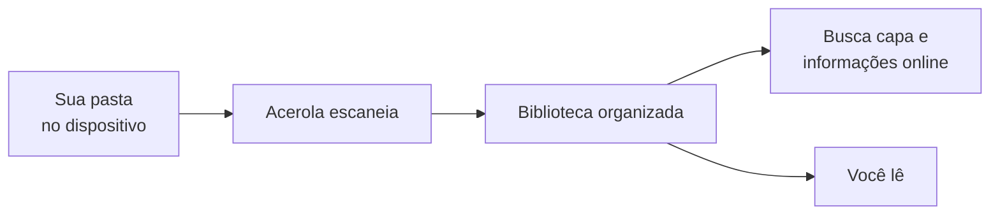
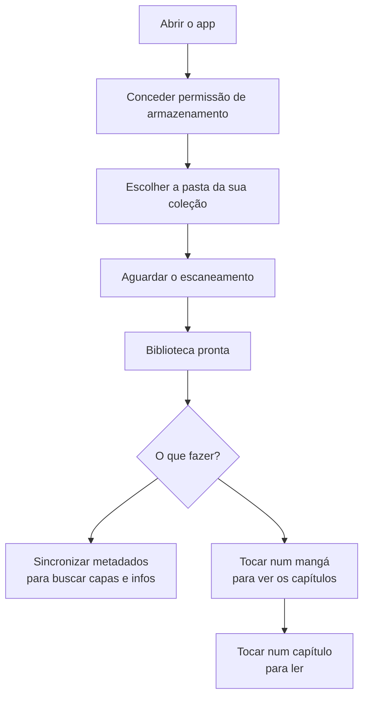

# Acerola

Acerola é um leitor de mangá para Android focado em coleções locais. Você aponta para uma pasta no seu dispositivo, o app encontra os arquivos e monta sua biblioteca automaticamente.

---

## Galeria

Aqui estão alguns exemplos de como o Acerola funciona:

<table>
  <tr>
    <td align="center" width="33%">
      <strong>Home</strong> 
      
    </td>
    <td align="center" width="33%">
      <strong>Configuração Manga</strong> 
      
    </td>
    <td align="center" width="33%">
      <strong>Configuração Geral</strong> 
      
    </td>
  </tr>
  <tr>
    <td align="center" width="33%">
      <strong>Histórico</strong> 
      
    </td>
    <td align="center" width="33%">
      <strong>Modos de leitura</strong> 
      
    </td>
    <td align="center" width="33%">
      <strong>Webtoon</strong> 
      
    </td>
  </tr>
</table>

---

---

## Funcionalidades

- **Biblioteca**: Escaneia pastas do dispositivo, detecta novos arquivos automaticamente, exibe em grade/lista, permite busca e organização por categorias.
- **Metadados**: Busca capa, sinopse, autor e gênero automaticamente (MangaDex, AniList, ComicInfo). Permite trocar fontes e editar manualmente.
- **Leitura**: Abre `.cbz` e `.cbr` diretamente. Converte `.pdf` para `.cbz`. Possui paginação configurável e salva o progresso automaticamente.
- **Histórico**: Mostra mangás lidos recentemente.
- **Temas**: Várias opções (Catppuccin, Dracula, Alucard, Nord).

---

## Como usar

1. Na primeira abertura, conceda permissão de acesso ao armazenamento.
2. Configure a pasta onde seus mangás estão.
3. O app escaneia e monta a biblioteca.
4. Sincronize os metadados para o app buscar as informações online.
5. Leia.

---

## Formatos suportados

| Formato | Descrição |
|---------|-----------|
| `.cbz` | Comic Book ZIP — arquivo zip com imagens dentro |
| `.cbr` | Comic Book RAR — arquivo rar com imagens dentro |
| `.pdf` | Convertido automaticamente para `.cbz` na primeira leitura |
